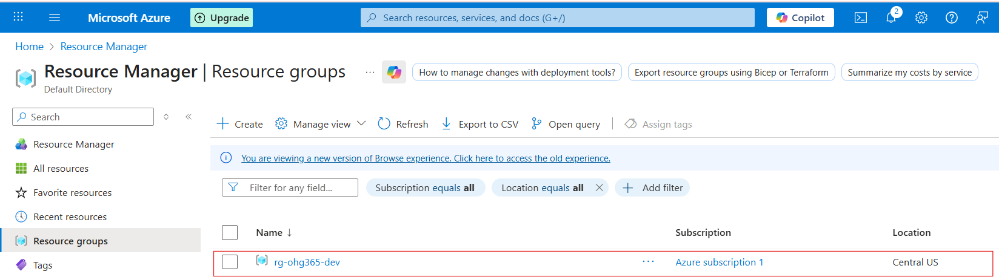

# 2. Subscriptions (Middle Layer)

What it is: Underneath management groups, you have subscriptions. A subscription is like a container for Azure resources, where you’ll define limits on resources and billing.

Purpose: It helps with organizing resources, managing access, and billing. You can have multiple subscriptions for different projects or teams. Each subscription has its own resource limits and billing.

Example: If your company has different projects, like a website and an app, you could create separate subscriptions for them. One for the website, one for the app.

### Related Images

