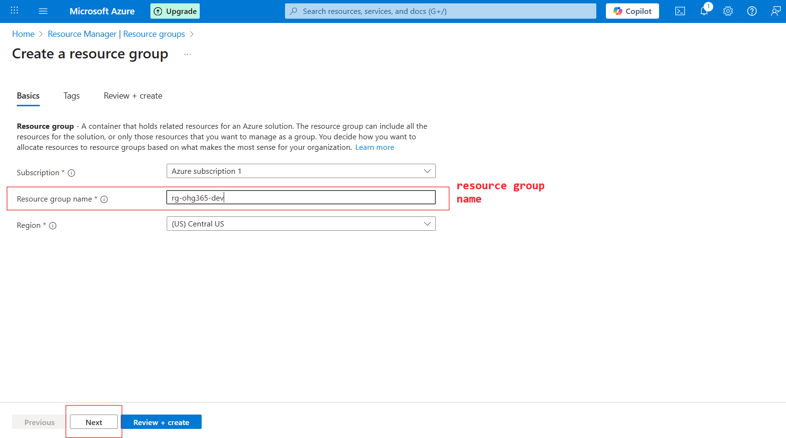
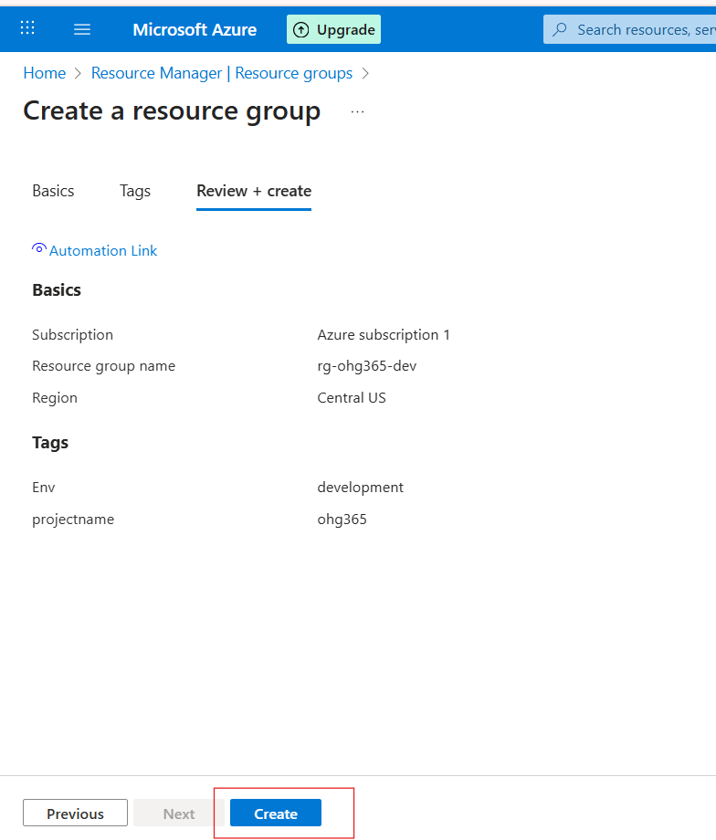

# 2.2 Create a Resource Group

### Sign in to the Azure Portal

### In the search menu, search for Resource groups.

### Related Images

### Click on the resource group and click on the create button

### Related Images

### Overview of resource group:

Name: rg-ohg365-dev → This is your Resource Group’s name.Usually, names include clues about the project or environment:

### rg = Resource Group

### ohg365 = Project or team name

### dev = Environment (like dev, test, or prod)

### Buttons:

### ➕ Create: Add new Azure resources (like VMs, storage, databases).

### ⚙️ Manage view: Customize how your resources list looks.

### 🗑️ Delete resource group: Deletes the entire group and all its resources (be careful!).

### 🔁 Refresh: Updates the view if new resources were added.

### 📤 Export to CSV: Export your resource details (helpful for reports).

### 📊 Open query: Create or run custom filters using Azure Resource Graph.

