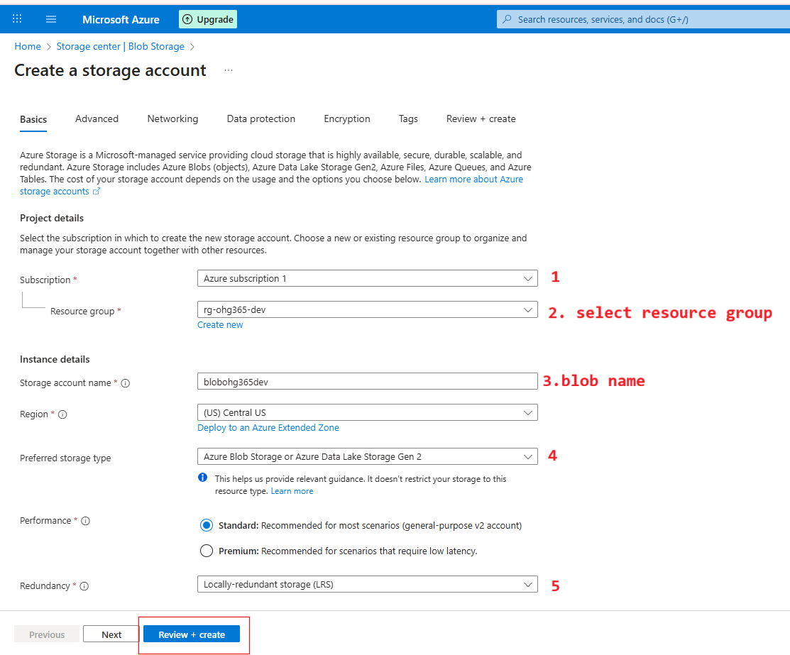
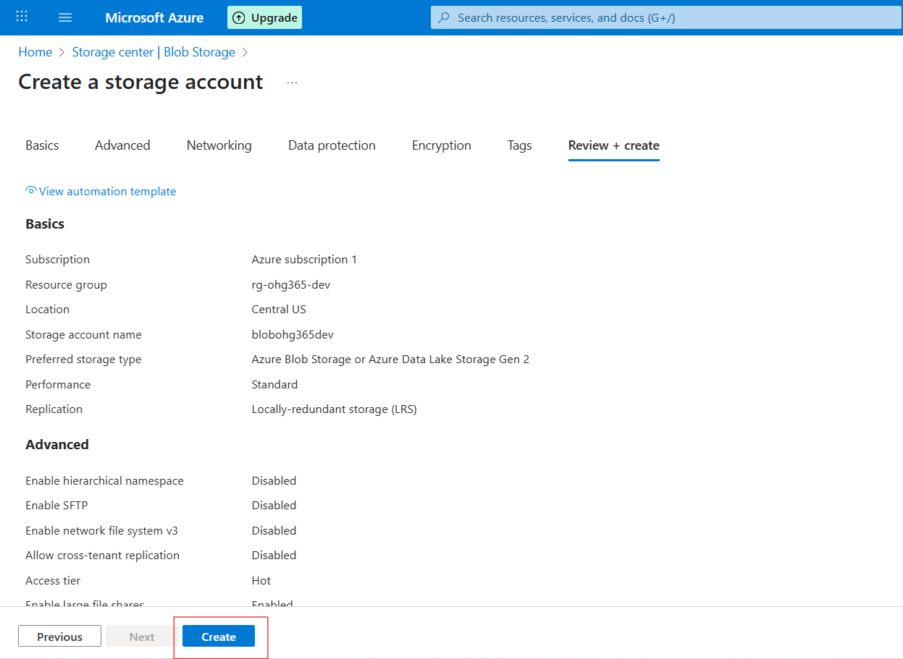
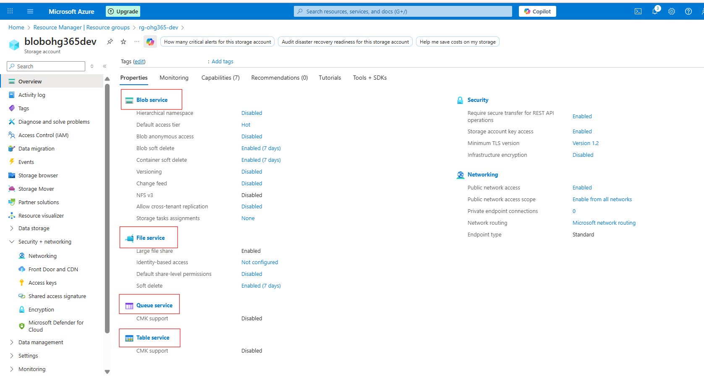

# 3.1 Create an Azure Blob Storage:

### Go to Azure Portal

### In the search bar, type “Storage Accounts” or “blob”

### Related Images

### Click on storage accounts and click on create button

### Related Images

### Click “Review + Create”

### Related Images

### 1️⃣ Subscription

### This is where you choose which Azure Subscription will own this storage account.

### A subscription is linked to your billing and access control.

Example: You might have separate subscriptions for development, testing, or production environments.🟦 You selected: Azure subscription 1

### 2️⃣ Resource Group

### Choose or create a Resource Group to organize related Azure resources.

Resource Groups act like folders — all your related resources (VMs, storage, databases) are stored here for easy management.

In your case, you selected rg-ohg365-dev, which is perfect for development resources.🟦 Tip: Keeping related resources in the same group helps you track cost, permissions, and manage everything easily.

### 3️⃣ Storage Account Name

### This is the unique name for your storage account (like a domain name).

### It must be globally unique, lowercase, and 3–24 characters long.

### This name will form part of the URL to access your data.

### 🧩 Example:If your name is blobohg365dev

### 4️⃣ Preferred Storage Type

### Select what kind of storage service you want to enable.

### The default (and most common) option is:Azure Blob Storage or Azure Data Lake Storage Gen2

### 🧠 This means your account will support:

### Blob storage (for files, media, etc.)

### Data Lake capabilities (for analytics and big data processing)

### 🟦 Tip: Keep this as default unless you have a specific need for file shares or queue services.

### 5️⃣ Performance & Redundancy Settings

### ⚙️ Performance:

### Standard: Uses HDD-based storage — cheaper, good for general use.

Premium: Uses SSD-based storage — faster, ideal for workloads needing low latency (like databases or VMs).

### 🟦 You selected: Standard (recommended)

### 🧭 Redundancy:

### Defines how Azure will replicate your data to keep it safe.

### Option

### Meaning

### Copies of Data

### LRS (Locally-redundant storage)

### Keeps 3 copies in one data center

### 3

### ZRS (Zone-redundant storage)

### Copies across 3 availability zones in the same region

### 3

### GRS (Geo-redundant storage)

### Copies data to another region (for disaster recovery)

### 6

### RA-GRS (Read-access Geo-redundant)

### Same as GRS but allows read access to secondary region

### 6

### 🟦 You selected: LRS (best for development/testing)

### Click on create

### Related Images

### Navigate to Your Resource Group

### In the left-hand menu, click on Resource groups

Find and click your resource group — in your case:👉 rg-ohg365-dev

### Check for the Storage Account

Inside the Overview tab of your resource group, you’ll see a list of all resources.

Look for an item that looks like this:Type: Storage accountName: blobohg365dev (or whatever name you used)

If it appears there, 🎉 congratulations — your Blob Storage account has been successfully created

### Related Images

