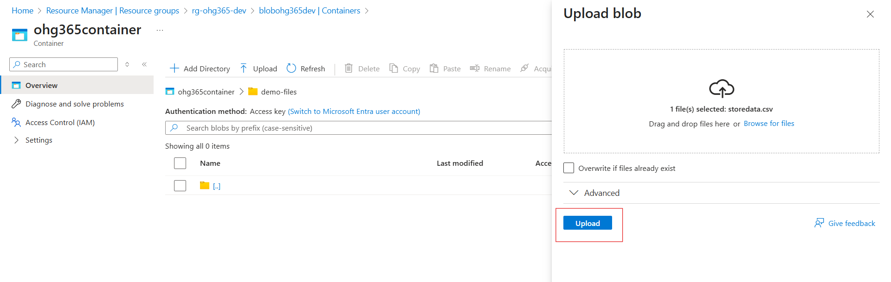
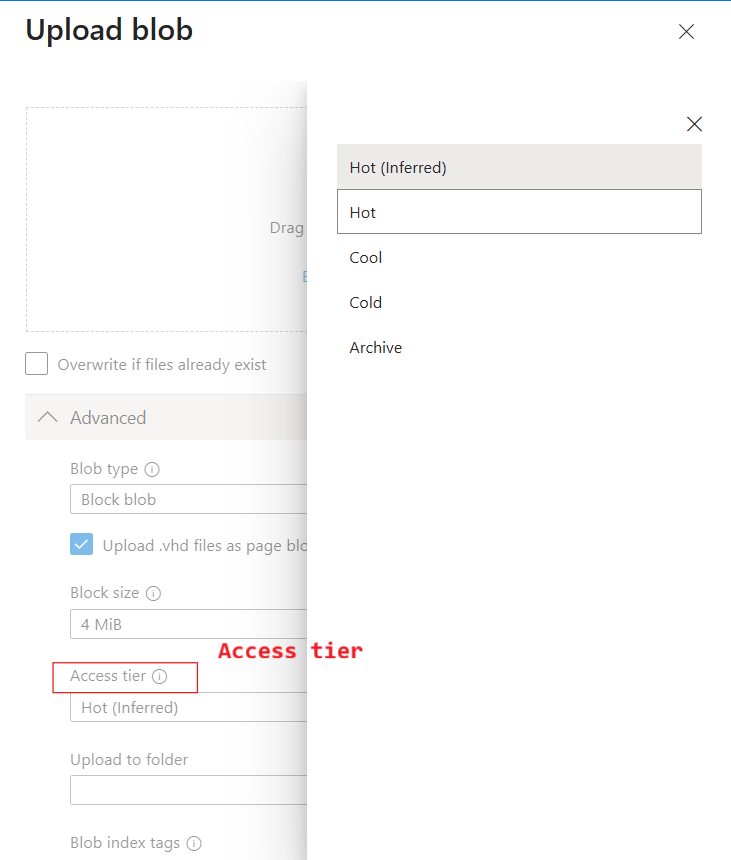
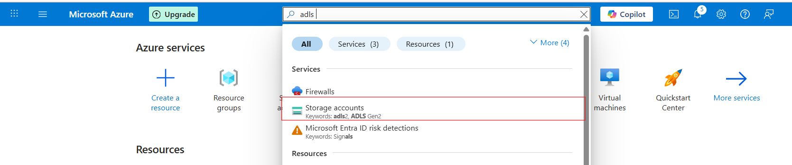
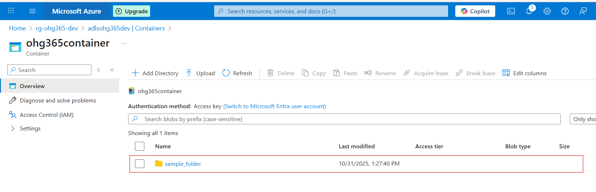
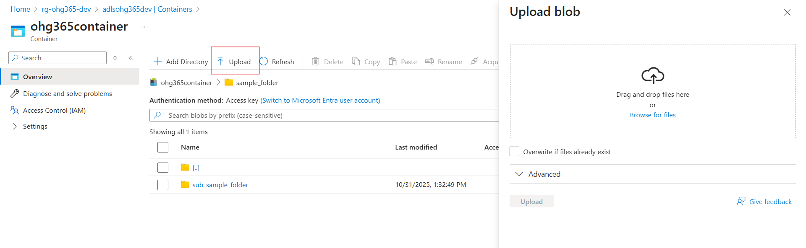

# 3.2 Types of Azure Storage Services:

### Azure Storage provides four main types of services under one Storage Account.

### Related Images

### 1️⃣ Blob Service

🧱 Used to store unstructured or semi-structured data like files, images, videos, logs, and backups.

### 🔹 Description:

### Stores data as Blobs (Binary Large Objects) inside containers.

### Best for storing flat files and large objects that don’t fit in a database.

Data can be text, binary, documents, media, or backups.

### 💾 Example Uses:

Storing images or videos for websites

Backups and archives

Data lake for analytics

Hosting static websites

### 📦 Example File Types:

.txt, .csv, .json, .xml, .jpg, .mp4, .zip, .bak

### 2️⃣ File Service

📁 Used for shared file storage that behaves like a traditional file server.

### 🔹 Description:

### Provides Azure Files, a fully managed file share in the cloud.

Uses the SMB (Server Message Block) or NFS (Network File System) protocols — the same used by on-premises file servers.

### Can be mounted to Windows, Linux, or macOS systems.

### 💾 Example Uses:

Shared network drives for teams

“Lift and shift” of on-premises file servers

Application configurations shared across multiple VMs

### 📦 Example Scenario:

You have multiple virtual machines needing access to the same configuration files — you can store those files in Azure Files and mount them just like a shared folder.

### 3️⃣ Queue Service

📬 Used for reliable messaging between application components.

### 🔹 Description:

### Provides asynchronous communication between services using message queues.

### Stores messages in a queue, which can be processed later by background services or workers.

### Ensures messages are delivered at least once and processed in FIFO (First-In, First-Out) order.

### 💾 Example Uses:

Sending background jobs (like image processing or email sending)

Decoupling app components for scalability

Event-driven architecture

### 📦 Example Scenario:

A web app uploads an image → sends a message to a queue → a background process picks it up and resizes the image.

### 4️⃣ Table Service

🧮 Used to store large amounts of structured, non-relational data.

### 🔹 Description:

### Provides NoSQL key-value storage.

### Stores data in tables with entities (rows) and properties (columns).

Flexible schema — you can add or remove columns anytime.

### 💾 Example Uses:

Storing user profiles, IoT data, or metadata

Fast lookups by key

Lightweight applications needing scalable, cheap storage

### 📦 Example Scenario:

You have millions of IoT sensors sending temperature data — you can store this efficiently in Azure Table Storage.

### 🧠 Summary Table

### Storage Service

### Type of Data

### Description

### Example Use Case

### Blob Service

Unstructured / Semi-structured

Stores large objects (files, media, backups)

Images, videos, logs

### File Service

File-based

Shared file storage via SMB/NFS

Shared drives, app configs

### Queue Service

Messaging

Message-based communication between components

Background tasks, event processing

### Table Service

Structured (NoSQL)

Key-value, schema-less table storage

User profiles, IoT data

### Explore Blob Service

Once your storage account is created:

### Go to your Storage Account

### Related Images

### Under Data storage, click Containers → This is where your blobs live.

### Click ➕ Container to create one:

Name: images, videos, or backups (any name)

### Public access level:

Private (default) – Only you can access

Blob (anonymous read) – Anyone with the link can read blobs

Container (public) – Everyone can see contents

### Click Create

### Related Images

### Upload & Manage Blobs

Click your new container (e.g., images)

### Click Upload

Choose a file from your computer (like a .jpg, .txt, or .mp4)

Once uploaded, you can:

### View Properties (size, type, last modified)

### Get the URL to access the file

### Change the access tier

Storage Account

└── Blob Service

└── Container (like a folder)

└── Blob (the actual file)

### Related Images

### Types of Blob Types:

### Related Images

### Blob Type

### Best For

### Example Use

🧱 Block Blob

Storing text or binary data

Images, videos, documents, CSVs

📜 Append Blob

Data that is constantly added to (append-only)

Logs, telemetry, audit data

📄 Page Blob

Random read/write access

Virtual machine disks (VHD files)

### 🧱 1. Block Blob

### Most common blob type used in Azure.

### 💡 What it is:

### Stores text and binary data (files like .txt, .jpg, .mp4, .csv, etc.)

### Data is split into blocks, and each block is identified by a block ID.

You can upload or update blocks individually and commit them together.

### ✅ Use Cases:

Storing images, videos, PDFs, and backups.

Data files for analytics (CSV, JSON, Parquet).

Large files uploaded in chunks.

### 📘 Example:

You upload a 500 MB video file — Azure divides it into smaller blocks and uploads each part separately for speed and reliability.

### 📜 2. Append Blob

### Special type of blob for data that grows over time.

### 💡 What it is:

Optimized for append operations — you can only add new data to the end, not modify or delete existing data.

Each time you add new information, it’s appended to the blob.

### ✅ Use Cases:

Storing log files.

Application telemetry or diagnostics data.

Streaming data that’s constantly being added.

### 📘 Example:

You’re logging website visits. Each time a new visitor arrives, their data (timestamp, IP, etc.) is appended to the existing log file.

### 📄 3. Page Blob

### Designed for random read/write operations.

### 💡 What it is:

### Data is stored in fixed-size 512-byte pages.

### Allows fast read and write access to specific parts of the blob.

### Commonly used for storing Virtual Hard Disk (VHD) files that power Azure Virtual Machines.

### ✅ Use Cases:

Storing Azure VM disks (OS and data disks).

Large databases that require random access.

Any workload that reads/writes frequently to specific sections of a file.

### 📘 Example:

When you start an Azure Virtual Machine, its disk (a .vhd file) is stored as a Page Blob, allowing the VM to quickly read or write data anywhere on the disk.

### Blob Type

### Structure

### Read/Write Behavior

### Common Use

### Block Blob

Data stored as blocks

Upload/replace blocks

Files, media, documents

### Append Blob

Sequentially added blocks

Append-only

Logs, telemetry, streaming data

### Page Blob

Fixed 512-byte pages

Random read/write

VM disks, large databases

Types of Access Tiers:

Azure lets you store data in different tiers based on how often you need it.This helps save money 💰 by matching storage cost to usage.

### Tier

### Cost

### Availability

### Best For

### Hot

💰 Highest cost

🔥 Always available

Frequently accessed data (e.g., active apps, websites)

### Cool

💸 Cheaper

🕓 Slight delay in access

Infrequently accessed data (e.g., monthly reports)

### Cold

💧 Cheaper than Cool

⏱️ Slower access

Rarely accessed data but still retrievable

### Archive

🧊 Cheapest

💤 Retrieval takes hours

Long-term backups, compliance storage

### Related Images

### Azure Storage provides four main types of services under one Storage Account.

### Related Images

### 1️⃣ Data Lake Storage

🧱 Purpose: Designed to store large volumes of unstructured or semi-structured data such as files, images, videos, logs, and backups.🔹 Key Features:

### Data is stored as Blobs (Binary Large Objects) within containers.

### Ideal for storing large, raw data that doesn’t fit into traditional databases.

### Supports various formats: text, binary, documents, media, and backups.

### 💾 Common Use Cases:

### Hosting media content like images and videos for websites.

### Long-term storage for backups and archival data.

### Centralized data lake for analytics and big data processing.

### Hosting static websites.

### 📦 Supported File Types:.txt, .csv, .json, .xml, .jpg, .mp4, .zip, .bak, and more.

### 2️⃣ File Service

📁 Used for shared file storage that behaves like a traditional file server.

### 🔹 Description:

### Provides Azure Files, a fully managed file share in the cloud.

Uses the SMB (Server Message Block) or NFS (Network File System) protocols — the same used by on-premises file servers.

### Can be mounted to Windows, Linux, or macOS systems.

### 💾 Example Uses:

Shared network drives for teams

“Lift and shift” of on-premises file servers

Application configurations shared across multiple VMs

### 📦 Example Scenario:

You have multiple virtual machines needing access to the same configuration files — you can store those files in Azure Files and mount them just like a shared folder.

### 3️⃣ Queue Service

📬 Used for reliable messaging between application components.

### 🔹 Description:

### Provides asynchronous communication between services using message queues.

### Stores messages in a queue, which can be processed later by background services or workers.

### Ensures messages are delivered at least once and processed in FIFO (First-In, First-Out) order.

### 💾 Example Uses:

Sending background jobs (like image processing or email sending)

Decoupling app components for scalability

Event-driven architecture

### 📦 Example Scenario:

A web app uploads an image → sends a message to a queue → a background process picks it up and resizes the image.

### 4️⃣ Table Service

🧮 Used to store large amounts of structured, non-relational data.

### 🔹 Description:

### Provides NoSQL key-value storage.

### Stores data in tables with entities (rows) and properties (columns).

Flexible schema — you can add or remove columns anytime.

### 💾 Example Uses:

Storing user profiles, IoT data, or metadata

Fast lookups by key

Lightweight applications needing scalable, cheap storage

### 📦 Example Scenario:

You have millions of IoT sensors sending temperature data — you can store this efficiently in Azure Table Storage.

### 🧠 Summary Table

### Datalake Service

### Type of Data

### Description

### Example Use Case

### Blob Service

Unstructured / Semi-structured

Stores large objects (files, media, backups)

Images, videos, logs

### File Service

File-based

Shared file storage via SMB/NFS

Shared drives, app configs

### Queue Service

Messaging

Message-based communication between components

Background tasks, event processing

### Table Service

Structured (NoSQL)

Key-value, schema-less table storage

User profiles, IoT data

### Explore Datalake Service

Once your storage account is created:

### Go to your Storage Account

### Related Images

### Under Data storage, click Containers → This is where your blobs live.

### Click ➕ Container to create one:

Name: images, videos, or backups (any name)

### Public access level:

Private (default) – Only you can access

Blob (anonymous read) – Anyone with the link can read blobs

Container (public) – Everyone can see contents

### Click Create

### Related Images

### Upload & Manage Blobs

Click your new container (e.g., images)

### Click Upload

Choose a file from your computer (like a .jpg, .txt, or .mp4)

Once uploaded, you can:

### View Properties (size, type, last modified)

### Get the URL to access the file

### Change the access tier

Storage Account

└── DataLake Service

└── Container (like a folder)

└── Blob (the actual file)

### Related Images

Subfolder:

### Related Images

Upload file:

### Types of Blob Types:

### Blob Type

### Best For

### Example Use

🧱 Block Blob

Storing text or binary data

Images, videos, documents, CSVs

📜 Append Blob

Data that is constantly added to (append-only)

Logs, telemetry, audit data

📄 Page Blob

Random read/write access

Virtual machine disks (VHD files)

### 🧱 1. Block Blob

### Most common blob type used in Azure.

### 💡 What it is:

### Stores text and binary data (files like .txt, .jpg, .mp4, .csv, etc.)

### Data is split into blocks, and each block is identified by a block ID.

You can upload or update blocks individually and commit them together.

### ✅ Use Cases:

Storing images, videos, PDFs, and backups.

Data files for analytics (CSV, JSON, Parquet).

Large files uploaded in chunks.

### 📘 Example:

You upload a 500 MB video file — Azure divides it into smaller blocks and uploads each part separately for speed and reliability.

### 📜 2. Append Blob

### Special type of blob for data that grows over time.

### 💡 What it is:

Optimized for append operations — you can only add new data to the end, not modify or delete existing data.

Each time you add new information, it’s appended to the blob.

### ✅ Use Cases:

Storing log files.

Application telemetry or diagnostics data.

Streaming data that’s constantly being added.

### 📘 Example:

You’re logging website visits. Each time a new visitor arrives, their data (timestamp, IP, etc.) is appended to the existing log file.

### 📄 3. Page Blob

### Designed for random read/write operations.

### 💡 What it is:

### Data is stored in fixed-size 512-byte pages.

### Allows fast read and write access to specific parts of the blob.

### Commonly used for storing Virtual Hard Disk (VHD) files that power Azure Virtual Machines.

### ✅ Use Cases:

Storing Azure VM disks (OS and data disks).

Large databases that require random access.

Any workload that reads/writes frequently to specific sections of a file.

### 📘 Example:

When you start an Azure Virtual Machine, its disk (a .vhd file) is stored as a Page Blob, allowing the VM to quickly read or write data anywhere on the disk.

### Blob Type

### Structure

### Read/Write Behavior

### Common Use

### Block Blob

Data stored as blocks

Upload/replace blocks

Files, media, documents

### Append Blob

Sequentially added blocks

Append-only

Logs, telemetry, streaming data

### Page Blob

Fixed 512-byte pages

Random read/write

VM disks, large databases

Types of Access Tiers:

Azure lets you store data in different tiers based on how often you need it.This helps save money 💰 by matching storage cost to usage.

### Tier

### Cost

### Availability

### Best For

### Hot

💰 Highest cost

🔥 Always available

Frequently accessed data (e.g., active apps, websites)

### Cool

💸 Cheaper

🕓 Slight delay in access

Infrequently accessed data (e.g., monthly reports)

### Cold

💧 Cheaper than Cool

⏱️ Slower access

Rarely accessed data but still retrievable

### Archive

🧊 Cheapest

💤 Retrieval takes hours

Long-term backups, compliance storage

