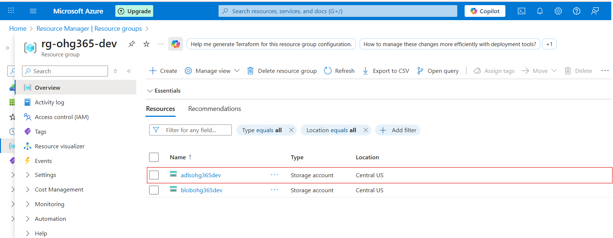
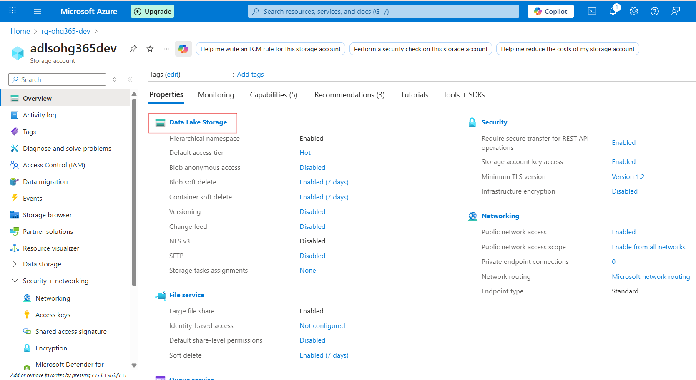

# 4.1 Create an Azure Data Lake Storage

### Go to Azure Portal

### In the search bar, type “Storage Accounts” or “ADLS Gen2”

### Related Images

### Click on storage accounts and click on create button

### Related Images

### Fill required details

### Related Images

### Navigate to Your Resource Group

### In the left-hand menu, click on Resource groups

Find and click your resource group — in your case:👉 rg-ohg365-dev

### Check for the Storage Account

Inside the Overview tab of your resource group, you’ll see a list of all resources.

Look for an item that looks like this:Type: Storage accountName: adlsohg365dev (or whatever name you used)

If it appears there, 🎉 congratulations — your ADLS Gen2 Storage account has been successfully created

### Related Images

